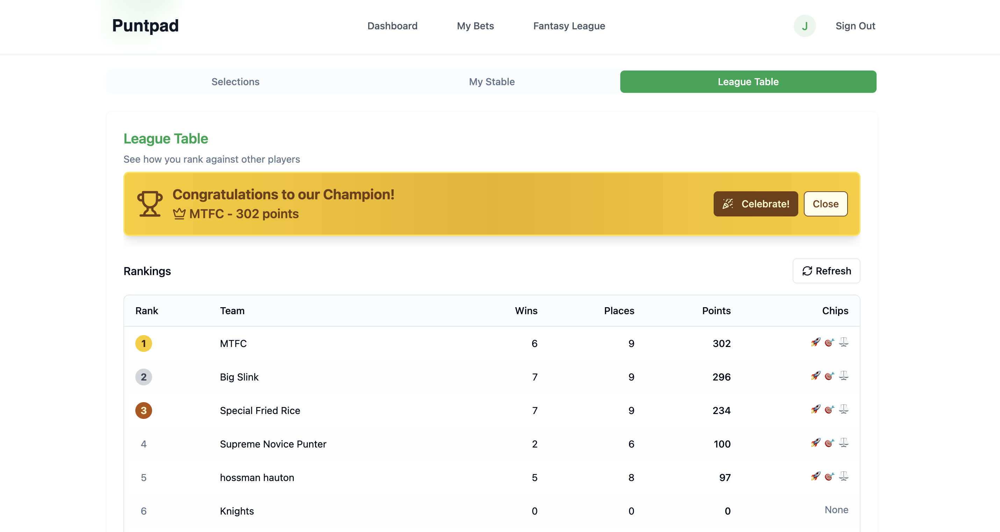

# Punt Pad 🎯

> Track Smarter, Win More - Your Ultimate Sports Betting & Fantasy League Companion

[](https://www.punt-pad.com/)
[]()
[](https://vercel.com)
[](https://www.typescriptlang.org/)
[]()

## 📊 Overview

Punt Pad is a comprehensive sports betting tracker and fantasy league platform designed to help punters make smarter decisions through data-driven insights. Whether you're tracking your bets, managing fantasy leagues with friends, or analyzing your performance, Punt Pad provides all the tools you need in one place.

## ✨ Features

#### 📈 Bet Tracking
- Input your bets with stake, odds, and selections
- Track win/loss rates and ROI calculations
- Filter bets by time periods, type (Single/Accumulator), and status
- Edit and update bet details and outcomes

#### 🏆 Fantasy League
- Successfully ran Cheltenham trial league - worked great!
- Power-up chips: Super Boost, Double Chance, and Triple Threat to boost your points
- Dynamic leaderboards showing real-time rankings
- Stable view to track your selections, winners, and losers
- More leagues coming soon!

## 📱 Screenshots

### Landing Page - Multi-Device View


### Dashboard - Bet Entry & Activity Overview


### My Bets - Comprehensive Bet Management


### Fantasy League - Stable View


### Fantasy League - Leaderboards


### Fantasy League - Selection Interface


## 🚀 Tech Stack

### Frontend
- **Framework**: [React](https://reactjs.org/) with [Vite](https://vitejs.dev/)
- **Language**: [TypeScript](https://www.typescriptlang.org/)
- **UI Components**: [shadcn/ui](https://ui.shadcn.com/)
- **Styling**: Tailwind CSS
- **State Management**: TanStack React Query + React Hooks

### Backend & Infrastructure
- **Database & Auth**: [Supabase](https://supabase.com/)
  - PostgreSQL database
  - Real-time subscriptions
  - Row Level Security (RLS)
- **Authentication**: OAuth integration via Supabase
- **Deployment**: [Vercel](https://vercel.com/)
- **Analytics**: Vercel Analytics

### Development Tools
- **Package Manager**: npm
- **Linting**: ESLint
- **Version Control**: Git & GitHub

## 🛠️ Installation & Development

### Prerequisites
- Node.js 18+ 
- npm
- Supabase account

### Local Development

1. **Clone the repository**
```bash
git clone https://github.com/JackDilger/punt-pad.git
cd punt-pad
```

2. **Install dependencies**
```bash
npm install
# or
pnpm install
```

3. **Set up environment variables**
Create a `.env` file in the root directory:

```env
VITE_SUPABASE_URL=your_supabase_url
VITE_SUPABASE_ANON_KEY=your_supabase_anon_key
```

4. **Run the development server**
```bash
npm run dev
```

5. **Open your browser**
Navigate to [http://localhost:5173](http://localhost:5173)

### Database Setup

1. Create a new Supabase project
2. Run the migration files in `/supabase/migrations`
3. Set up Row Level Security policies
4. Configure OAuth providers in Supabase dashboard

## 📱 Platform Support

- ✅ Web Browser (Desktop)
- ✅ Mobile Web (iOS/Android)
- ✅ Tablet Optimized

## 🎯 Use Cases

### Bet Tracking
- Track your betting performance and ROI
- Filter and analyze your betting history
- Monitor win/loss patterns over time

### Fantasy Leagues
- Compete with friends in seasonal leagues
- Use strategic power-up chips to boost points
- Track your selections and performance

## 🔒 Privacy & Security

- **SSL Encryption** - All connections secured with HTTPS
- **Supabase RLS** - Row Level Security for data protection
- **OAuth Authentication** - Secure login via trusted providers
- **Data Ownership** - Complete user control over personal data
- **GDPR Compliant** - Privacy-first approach

## 🗺️ Roadmap

### Coming Soon
- [ ] More fantasy leagues beyond Cheltenham
- [ ] Enhanced betting analytics
- [ ] Improved mobile experience

## 🤝 Contributing

We welcome contributions! Please check out our contributing guidelines:

1. Fork the repository
2. Create your feature branch (`git checkout -b feature/AmazingFeature`)
3. Commit your changes (`git commit -m 'Add some AmazingFeature'`)
4. Push to the branch (`git push origin feature/AmazingFeature`)
5. Open a Pull Request

## 📧 Support & Contact

- **Website**: [https://www.punt-pad.com/](https://www.punt-pad.com/)
- **GitHub**: [https://github.com/JackDilger/punt-pad](https://github.com/JackDilger/punt-pad)

## ⚖️ Legal

### Disclaimer
Punt Pad is a tracking, analytics, and fantasy sports platform. We do not facilitate real-money betting, provide betting services, or encourage gambling. Users are responsible for following local laws and regulations regarding sports betting and fantasy sports in their jurisdiction.

### Responsible Gambling
- Always play within your means
- Set limits and stick to them
- Never chase losses
- Take regular breaks
- Seek help if gaming becomes a problem

**Need Help?** 
- 🇬🇧 UK: GamCare - 0808 8020 133
- 🇺🇸 US: National Problem Gambling Helpline - 1-800-522-4700
- 🇦🇺 AU: Gambling Help - 1800 858 858

---

<div align="center">

**🚀 Start Tracking Smarter Today!**

Visit [punt-pad.com](https://www.punt-pad.com/) to begin your journey

Built with ❤️ using React, TypeScript, Supabase, and Vercel

</div>

